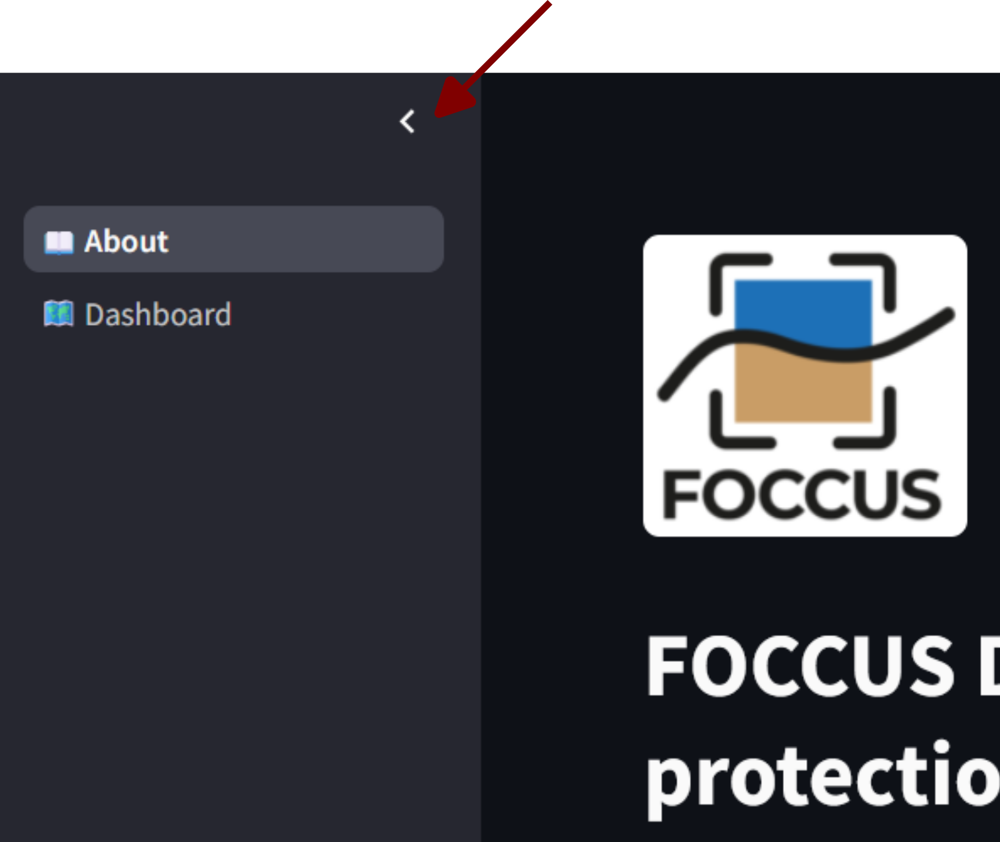

# Customising the FOCCUS demonstrator for your case

This guide explains how to point the app at **different files on Edito**, update the **About page** (`ESC1GB.md`), and **add new indicators** to the dashboard.

The app has two pages:

| Page | Entry / file | Purpose |
|------|----------------|---------|
| About | `foccus_about_page.py` → `ESC1GB.md` | Documentation, images, PDF |
| Dashboard | `foccus_dashboard_page.py` → `app_pmtiles_assessment_s3.py` | Maps + polygon assessment |

**Recommended run command (local):**

```bash
streamlit run app_pmtiles_assessment_two_paged_s3.py
```

**Alternate demonstrator (e.g. Black Sea / Douglas):**

```bash
APP_CONFIG=config/black_sea_douglas.yaml streamlit run app_pmtiles_assessment_two_paged_s3.py
```

On Windows PowerShell:

```powershell
$env:APP_CONFIG = "config\black_sea_douglas.yaml"
streamlit run app_pmtiles_assessment_two_paged_s3.py
```

---

## 0. YAML configuration (preferred)

Most demonstrator-specific settings are in **`config/*.yaml`**, loaded by `app_config.py`:

| File | Use case |
|------|----------|
| `config/german_bight.yaml` | Default — German Bight, Streamlit Cloud |
| `config/black_sea_douglas.yaml` | Douglas / Black Sea data on Edito |

Each YAML file defines:

- **app** — titles, tagline, logo filenames, about markdown file  
- **s3** — `endpoint_url`, `bucket`, `prefix`  
- **domain** — `default_run_date`, `bounds` (south, west, north, east)  
- **indicators** — PMTiles/NetCDF filenames, variables, colormaps, thresholds  

Select a config with the environment variable **`APP_CONFIG`** (path relative to the project root). If unset, `config/german_bight.yaml` is used.

---

## 1. Edito S3 — where data lives

Scientific data is **not** in GitHub. It is read at runtime from Edito MinIO.

### 1.1 Configure bucket and prefix

Edit **`config/german_bight.yaml`** (or copy it for a new case):

```yaml
s3:
  endpoint_url: "https://minio.dive.edito.eu"
  bucket: "oidc-jacobb"
  prefix: "Hereon/IndicatorAssesment"

domain:
  default_run_date: "2026-06-04"
  bounds: [53.04, 5.12, 55.63, 10.40]   # south, west, north, east
```

**URL pattern** the browser uses for PMTiles (public bucket):

```
https://minio.dive.edito.eu/<S3_BUCKET>/<S3_PREFIX>/<YYYYMMDD>/<filename>
```

Example:

```
https://minio.dive.edito.eu/oidc-jacobb/Hereon/IndicatorAssesment/20260604/q95_Hs_tris.pmtiles
```

The app builds this automatically via `public_s3_url()` when `USE_LOCAL_PMTILES_PROXY = False` (default — required for Streamlit Cloud and Docker).

### 1.2 Folder layout per forecast run

Each simulation date is one subfolder named **`YYYYMMDD`**:

```
s3://<bucket>/<S3_PREFIX>/
└── 20260604/
    ├── q95_ssh_tris.pmtiles
    ├── q95_ssh.nc
    ├── q95_Hs_tris.pmtiles
    ├── q95_Hs.nc
    ├── q95_tau_tris.pmtiles
    ├── q95_tau.nc
    ├── R1_tris.pmtiles
    ├── R1.nc
    ├── nveg_tris.pmtiles
    ├── nveg.nc
    └── mesh_spatial_index.npz    # speeds up polygon assessment
```

| File type | Role |
|-----------|------|
| `*_tris.pmtiles` | Fast triangle mesh map (MapLibre / PMTiles) |
| `*.nc` | Exact polygon statistics, threshold map, histogram |
| `mesh_spatial_index.npz` | Spatial index for fast mesh lookup (optional but recommended) |

Upload new runs as new date folders; the dashboard **Run date** picker selects the folder.

### 1.2b Vegetation scenarios (no_veg / with_veg / diff)

To compare **vegetation-free**, **with vegetation**, and **difference** layers, use **three subfolders per run date**:

```
YYYYMMDD/
├── no_veg/     … reference simulation
├── with_veg/   … NbS / seagrass simulation
└── diff/       … precomputed (with_veg − no_veg) per triangle
```

Enable in YAML (`config/german_bight_scenarios.example.yaml`):

```yaml
scenarios:
  default: no_veg
  items:
    no_veg:
      label: "Vegetation-free"
      subfolder: "no_veg"
    with_veg:
      label: "With vegetation"
      subfolder: "with_veg"
    diff:
      label: "Change (with − without)"
      subfolder: "diff"
      is_difference: true
```

The dashboard then shows a **Scenario** dropdown. Difference PMTiles must be **built in postprocessing** (not in the browser) — see **`scripts/scenario_diff_pmtiles.md`**.

Without a `scenarios:` block, the app keeps the flat layout (`YYYYMMDD/file.pmtiles`) for backward compatibility.

---

Objects must be readable **without login** (anonymous GET + HTTP Range). Quick test in a browser (incognito):

```
https://minio.dive.edito.eu/<bucket>/<prefix>/20260604/q95_Hs_tris.pmtiles
```

- **200 OK** → fine for Streamlit Cloud / Docker  
- **403 / AccessDenied** → fix bucket/object policy in [MinIO Console](https://minio-console.dive.edito.eu/)

No Streamlit secrets are needed for S3 when the bucket is public.

### 1.4 Uploading files (MinIO Console)

1. Open [MinIO Console](https://minio-console.dive.edito.eu/) and log in.  
2. Browse to your bucket → prefix → create or open folder `YYYYMMDD`.  
3. Upload matching `.pmtiles`, `.nc`, and optionally `mesh_spatial_index.npz`.  
4. Keep **filenames identical** to what you configure in `INDICATOR_LAYERS` (see below).

---

## 2. Add or change indicators (dashboard)

Indicators are defined under **`indicators:`** in your YAML config file (e.g. `config/german_bight.yaml`).

### 2.1 Example entry (YAML)

```yaml
indicators:
  "SSH q95":
    file: "q95_ssh_tris.pmtiles"
    nc_file: "q95_ssh.nc"
    nc_variable: "q95_ssh"
    attribute: "q95_ssh"
    caption: "SSH q95 (m)"
    unit: "m"
    cmap: "plasma"
    critical_default: 1.0
```

| Key | Meaning |
|-----|---------|
| **Dictionary key** (e.g. `"SSH q95"`) | Label in the **Indicator** dropdown |
| `file` | PMTiles filename in the run folder |
| `nc_file` | NetCDF filename in the run folder |
| `nc_variable` | Variable name inside the NetCDF for polygon stats |
| `attribute` | Property name **inside the PMTiles** vector tiles (must match tippecanoe export) |
| `caption` | Colorbar / legend text on the map |
| `unit` | Shown in stats panel |
| `cmap` | Matplotlib colormap name, or `erosion_risk` for R1 (see `CMAP_OPTIONS` in `pmtiles_s3_common.py`) |
| `critical_default` | Default threshold for exceedance donut / threshold map |

Optional keys:

| Key | When to use |
|-----|-------------|
| `attribute_fallbacks` | Tuple of alternate PMTiles attribute names if metadata uses a different name |
| `value_min_default`, `value_max_default` | Color-scale slider bounds |
| `use_domain_bounds` | Fit map to full German Bight domain (used for sparse R1 layer) |

### 2.2 Example — add SSC q95

`ESC1GB.md` already lists SSC q95 in the table; to enable it in the app:

1. Upload to Edito (per run folder):

   - `q95_ssc_tris.pmtiles`
   - `q95_ssc.nc`

2. Confirm the PMTiles attribute name (e.g. with tippecanoe metadata or a small Python snippet using `pmtiles.reader.Reader`).

3. Add under `indicators:` in your YAML config:

```yaml
  "SSC q95":
    file: "q95_ssc_tris.pmtiles"
    nc_file: "q95_ssc.nc"
    nc_variable: "q95_ssc"
    attribute: "q95_ssc"
    caption: "SSC q95"
    unit: "-"
    cmap: "YlOrRd"
    critical_default: 0.1
```

4. Update `ESC1GB.md` if the description or units differ.
5. Restart Streamlit and pick the new indicator + run date.

### 2.3 Erosion risk (R1) — special case

Use the built-in categorical scheme in YAML:

```yaml
    cmap: "erosion_risk"
    value_min_default: 0.25
    value_max_default: 1.0
    use_domain_bounds: true
```

Critical level is chosen as **Low / Increased / High** (not a numeric input). Constants live in `pmtiles_s3_common.py` (`EROSION_R1_*`).

### 2.4 Naming rules (important for Streamlit Cloud)

- The dropdown label may contain spaces (e.g. `"SSH q95"`).  
- The code sanitises internal JS names automatically (`pmtiles_s3_common.py`).  
- **PMTiles / NetCDF filenames** should use only letters, numbers, underscores — no spaces.  
- `attribute` must match the property stored in the PMTiles layer (often the same as `nc_variable`).

### 2.5 Debug mode

In `app_pmtiles_assessment_s3.py`, set:

```python
Debug = True
```

This shows the resolved S3 URIs for PMTiles and NetCDF in the top bar — useful when a file is missing or misnamed.

---

## 3. Update the About page (`ESC1GB.md`)

The About page is rendered by `foccus_about_page.py`, which reads **`ESC1GB.md`** from the project root.

### 3.1 Ordinary markdown

Edit headings, tables, and text directly in `ESC1GB.md`. Standard Markdown works; HTML is allowed in places (e.g. the logo header).

### 3.2 Local images

Put image files in the **project root** (same folder as `ESC1GB.md`) and reference them:

```html

```

Supported: `.png`, `.jpg`, `.jpeg`, `.gif`, `.webp`.  
`width="N%"` is honoured for proportional sizing.

### 3.3 Embed a PDF at a chosen position

```text
streamlit_insert_pdf="DF122.pdf"
```

Place this line **where** the PDF should appear. The PDF must sit in the project root.

### 3.4 Logo header

The flex header at the top uses local + remote images:

```html
<div style="display: flex; justify-content: space-between; align-items: center;">
  
  
</div>
```

### 3.5 Keep documentation in sync with the dashboard

When you add an indicator:

1. Add a row to the **Indicators** table in `ESC1GB.md` (symbol, description, unit).  
2. Mention it in the “Select a forecast and indicator” bullet list if needed.  
3. For R1-like indicators, document thresholds in the ERI section.

Example table row:

```markdown
| Near-bottom suspended sediment concentration q95 | SSC q95 | 95th percentile of near-bottom SSC | — |
```

---

## 4. Project README (GitHub / deployment)

There is no `README.md` in the repo yet. For collaborators or deployment, create one with at least:

- Project title and link to the live app  
- `streamlit run app_pmtiles_assessment_two_paged_s3.py`  
- Pointer to **this file** (`modify_for_my_case.md`) for customisation  
- Note that data lives on Edito, not in the repo  
- Python **3.13** on Streamlit Cloud  
- `requirements.txt` includes `streamlit-folium==0.25.0` (do not remove without testing maps)

**Docker alternative:**

```bash
docker build -t foccus-esc1-gb .
docker run --rm -p 8501:8501 foccus-esc1-gb
```

---

## 5. Checklist — new forecast run + new indicator

- [ ] Create folder `YYYYMMDD` on Edito under `S3_PREFIX`  
- [ ] Upload `*_tris.pmtiles` and matching `.nc` for each indicator  
- [ ] Upload `mesh_spatial_index.npz` (or let the app build index from NetCDF on first use — slower)  
- [ ] Verify public HTTPS URL opens in incognito  
- [ ] Add / update entries in `INDICATOR_LAYERS` in `app_pmtiles_assessment_s3.py`  
- [ ] Set `DEFAULT_RUN_DATE` if you want a new default in `pmtiles_s3_common.py`  
- [ ] Update indicator table and text in `ESC1GB.md`  
- [ ] Test locally: `streamlit run app_pmtiles_assessment_two_paged_s3.py`  
- [ ] Push to GitHub and redeploy Streamlit Cloud (or rebuild Docker image)

---

## 6. Files to touch (quick reference)

| Goal | File(s) |
|------|---------|
| S3, domain, indicators, app text | `config/<your_case>.yaml` |
| Config loader | `app_config.py` |
| Map / assessment logic | `app_pmtiles_assessment_s3.py`, `pmtiles_s3_common.py` |
| About / documentation | `ESC1GB.md`, `foccus_about_page.py` |
| Dependencies / deploy | `requirements.txt`, `Dockerfile` |
| Two-page navigation | `app_pmtiles_assessment_two_paged_s3.py` |

---

## 7. Troubleshooting

| Symptom | Likely cause |
|---------|----------------|
| `Failed to load data from S3` | Wrong bucket/prefix/date, or file missing on Edito |
| Map empty on Streamlit Cloud | Old deploy without `streamlit-folium==0.25.0` or `USE_LOCAL_PMTILES_PROXY = True` |
| Map white, legend visible | Folium JS error — check layer names; use latest `pmtiles_s3_common.py` |
| Draw polygon tool missing | Same as above — ensure Draw plugin runs after PMTiles layer init |
| Polygon stats slow | Add `mesh_spatial_index.npz` to the run folder |
| Indicator in dropdown but no colours | `attribute` in config ≠ property name inside PMTiles |

For local-only debugging with a private bucket, you would need AWS credentials and signed URLs — the current demonstrator assumes **public** Edito objects.
